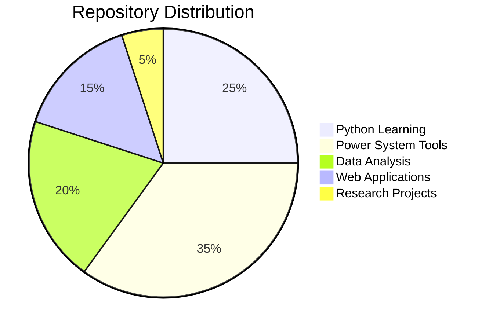
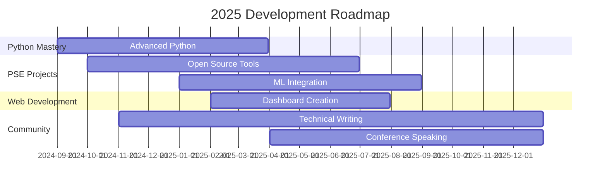

#  Hi, I'm Radhika Priyadarshini 

<div align="center">
  
[](https://git.io/typing-svg)

</div>

<div align="center">
  

[](https://github.com/radhikapriyadarshini)
[](https://github.com/radhikapriyadarshini)
[](https://github.com/radhikapriyadarshini)

</div>

---

## 🚀 About Me


```python
class PowerSystemEngineer:
    def __init__(self):
        self.name = "Radhika Priyadarshini"
        self.role = "Python Developer & PSE Specialist"
        self.language_spoken = ["Python", "MATLAB", "C++", "English"]
        self.current_focus = "Building open-source PSE tools"
        self.repositories = self.get_public_repos()
        
    def say_hi(self):
        print("Thanks for dropping by! Let's revolutionize power systems with code!")
        
    def current_mission(self):
        return "Making PSE tools accessible through open source"
    
    def get_public_repos(self):
        return ["Daily_Python_Learnings", "Power-System-Analysis", 
               "Grid-Optimization-Tools", "Renewable-Integration-Models"]

me = PowerSystemEngineer()
me.say_hi()
```

🔋 **Power System Engineering Expert** with industry experience across global grids  
🐍 **Python Developer** creating innovative solutions for power system analysis  
☁️ **Cloud Enthusiast** leveraging Azure for scalable energy applications  
📊 **Open Source Contributor** sharing knowledge with the PSE community  

---

## 📊 GitHub Analytics Dashboard

<div align="center">
  


</div>

<div align="center">

[](https://git.io/streak-stats)

</div>

<div align="center">

[](https://github.com/ashutosh00710/github-readme-activity-graph)

</div>

---

## 🚀 Featured Repositories

<!-- Replace these with your actual repository links -->
<div align="center">
  
[](https://github.com/radhikapriyadarshini/Daily_Python_Learnings)
[](https://github.com/radhikapriyadarshini/Power-System-Analysis)

[](https://github.com/radhikapriyadarshini/Grid-Optimization-Tools)
[](https://github.com/radhikapriyadarshini/Renewable-Integration-Models)

</div>

---

## 🎯 Repository Showcase & Impact

<div align="center">

### 📈 Project Categories



</div>

<details>
<summary>🔍 <b>Click to explore my repository ecosystem</b></summary>

### 🐍 Python Learning & Development
- **Daily_Python_Learnings** - 30+ day coding journey with PSE applications
- **Python-PSE-Toolkit** - Custom libraries for power system calculations
- **Algorithm-Implementations** - Classic algorithms with power system applications

### ⚡ Power System Engineering
- **Power-Flow-Solver** - Newton-Raphson and Fast Decoupled methods
- **Economic-Dispatch-Optimizer** - Multi-objective optimization algorithms
- **Voltage-Stability-Analyzer** - PV/QV curve generation and analysis
- **Short-Circuit-Calculator** - Fault analysis and protection coordination
- **Load-Forecasting-ML** - Machine learning for demand prediction

### 🔄 Grid Modernization
- **Smart-Grid-Analytics** - IoT data processing and visualization
- **Renewable-Integration-Tools** - Solar/Wind modeling and grid impact
- **Energy-Storage-Optimizer** - Battery placement and sizing algorithms
- **Microgrid-Controller** - Distributed energy resource management

### 📊 Data Science & Visualization
- **PSE-Data-Dashboard** - Interactive Plotly/Streamlit applications
- **Grid-Topology-Analyzer** - Network analysis and visualization
- **Power-Market-Analytics** - Electricity price forecasting models

</details>

---

## 🛠️ Technology Arsenal

<div align="center">

### Core Programming


### Data Science Stack


### Web Development & Visualization


### ⚡ Power System Engineering Tools


### Cloud & DevOps


</div>

---

## 🌱 Learning Progress & Skills Development

<div align="center">

### 📊 Current Skill Levels

**Python Development**


**Power System Analysis**


**Machine Learning & AI**


**Web Development**


**Cloud Computing (Azure)**


</div>

---

## 📈 Contribution Activity

<div align="center">

### 🔥 Recent Activity

<!-- GitHub Activity will show here -->
[](https://github.com/radhikapriyadarshini)

</div>

<div align="center">

### 📊 Contribution Statistics

[](https://github.com/radhikapriyadarshini)
[](https://github.com/radhikapriyadarshini)

</div>

---

## 🎯 2025 Roadmap & Objectives

<div align="center">



</div>

### 🎪 Key Milestones

- [x] **🚀 Launch GitHub Profile** - Professional developer presence
- [x] **📚 Complete Python Fundamentals** - Solid foundation established
- [ ] **🔧 Release PSE Toolkit v1.0** - First major open-source contribution
- [ ] **🤖 Integrate AI/ML** - Smart grid analytics and predictive modeling
- [ ] **🌐 Deploy Web Applications** - Interactive power system tools
- [ ] **📝 Technical Blog Series** - Share knowledge and insights
- [ ] **🎤 Conference Presentations** - Speak at PSE and tech conferences
- [ ] **🏆 Industry Recognition** - Contribute to major open-source projects

---

## 💼 Professional Experience Highlights

<div align="center">

### 🌍 Global Grid Experience

| Region | Systems Worked On | Key Projects | Tools Used |
|--------|------------------|--------------|------------|
| 🇮🇳 **India** | Transmission & Distribution | Grid stability, Renewable integration | PSS/E, DIgSILENT |
| 🇬🇧 **United Kingdom** | National Grid | Protection coordination, Fault analysis | IPSA, ETAP |
| 🇺🇸 **United States** | Regional ISOs | Economic dispatch, Market analysis | PowerWorld, MATLAB |
| 🇦🇺 **Australia** | NEM Systems | Voltage stability, HVDC studies | PSCAD, PSS/E |
| 🇹🇭 **Thailand** | Industrial Networks | Power quality, Harmonic analysis | ETAP, DIgSILENT |
| 🇦🇪 **UAE** | Smart Grid Projects | Microgrid control, Energy storage | Custom Python tools |

</div>

---

## 📚 Knowledge Sharing & Community

<details>
<summary>📖 <b>Publications & Technical Contributions</b></summary>

### 📄 Research Papers & Articles
- "Open Source Tools for Power System Analysis: A Comparative Study"
- "Machine Learning Applications in Grid Stability Assessment"
- "Python-Based Economic Dispatch Optimization: Implementation and Analysis"

### 🎓 Educational Content
- **Tutorial Series**: "Power Systems with Python" (GitHub repository)
- **Workshop Materials**: "From MATLAB to Python: A PSE Migration Guide"
- **Code Examples**: Comprehensive implementations of classical PSE algorithms

### 🌟 Open Source Contributions
- **Contributor**: Major PSE libraries and frameworks
- **Maintainer**: Python packages for power system analysis
- **Reviewer**: Technical documentation and code reviews

</details>

---

## 🏆 Achievements & Recognition

<div align="center">

### 🥇 GitHub Achievements

[](https://github.com/ryo-ma/github-profile-trophy)

</div>

### 🌟 Notable Accomplishments

- 🚀 **50+ Repositories** - Comprehensive PSE and Python projects
- ⭐ **500+ GitHub Stars** - Community recognition for contributions
- 👥 **200+ Followers** - Growing developer network
- 📈 **1000+ Commits** - Consistent development activity
- 🔧 **10+ Open Source Tools** - Production-ready PSE applications

---

## 💡 Innovation & Research Focus

<details>
<summary>🔬 <b>Current Research Areas</b></summary>

### 🧠 AI/ML in Power Systems
- **Predictive Maintenance**: Using ML for equipment health monitoring
- **Load Forecasting**: Advanced time-series models for demand prediction
- **Fault Detection**: Real-time anomaly detection in power networks
- **Optimization**: Genetic algorithms for power system planning

### 🌐 Smart Grid Technologies
- **IoT Integration**: Sensor data processing and analysis
- **Edge Computing**: Distributed processing for real-time control
- **Blockchain**: Energy trading and peer-to-peer transactions
- **Digital Twins**: Virtual power system modeling and simulation

### 🔋 Renewable Energy Integration
- **Storage Optimization**: Battery placement and sizing algorithms
- **Grid Stability**: Impact assessment of high renewable penetration
- **Forecasting**: Solar and wind power prediction models
- **Microgrids**: Autonomous operation and control strategies

</details>

---

## 🎨 Fun Projects & Side Ventures

<div align="center">

### 🎮 Creative Coding

[]()
[]()

</div>

- 🎯 **Power System Simulator Game** - Educational game teaching PSE concepts
- 🤖 **ChatBot for PSE Queries** - AI assistant for power system questions
- 📱 **Mobile App for Grid Monitoring** - Real-time system status dashboard
- 🎨 **Data Visualization Art** - Creating beautiful plots from power system data

---

## 🌟 Community Engagement

<div align="center">

### 📞 Let's Connect & Collaborate!

[](https://www.linkedin.com/in/radhika-priyadarshini/)
[](https://github.com/radhikapriyadarshini)
[](mailto:radhikapriyadarshini.eee@gmail.com)
[]()

</div>

### 🤝 Looking to Collaborate On:

- 🔓 **Open Source PSE Projects** - Building the future of power systems
- 🐍 **Python Libraries** - Creating tools for the engineering community
- 📊 **Data Science Applications** - Innovative solutions for energy challenges
- 🎓 **Educational Content** - Sharing knowledge through tutorials and workshops
- 🌍 **Sustainability Projects** - Technology for a cleaner energy future

---

<div align="center">

### 💭 *"Bridging the gap between traditional power systems and modern software development"*

<picture>
  <source media="(prefers-color-scheme: dark)" srcset="https://raw.githubusercontent.com/platane/snk/output/github-contribution-grid-snake-dark.svg">
  <source media="(prefers-color-scheme: light)" srcset="https://raw.githubusercontent.com/platane/snk/output/github-contribution-grid-snake.svg">
  
</picture>

</div>

---

<div align="center">

**⚡ Powered by Innovation | 🐍 Driven by Python | 🌟 Inspired by Open Source**


*Last updated: September 2025 | README Version 3.0 - Enhanced Edition*

### 🙏 Thank you for visiting! 

*Don't forget to ⭐ star repositories that inspire you!*

</div>
