#  Hi, I'm Radhika Priyadarshini 

<div align="center">
  
[](https://git.io/typing-svg)

</div>

<div align="center">
  

[](https://github.com/radhikapriyadarshini)
[](https://github.com/radhikapriyadarshini)

</div>

---

## 🚀 About Me


```python
class PowerSystemEngineer:
    def __init__(self):
        self.name = "Radhika Priyadarshini"
        self.role = "Python Learner & PSE Enthusiast"
        self.language_spoken = ["Python", "MATLAB", "English"]
        self.current_focus = "Building PSE tools from scratch"
        
    def say_hi(self):
        print("Thanks for dropping by! Let's build the future grid together!")
        
    def current_mission(self):
        return "Demystifying the 'black box' behind power system tools"

me = PowerSystemEngineer()
me.say_hi()
```

🔋 **Power System Engineering Enthusiast** passionate about understanding the **"black box"** behind industry tools  
🐍 **Python Developer** building custom solutions for power flow, stability, and grid optimization  
☁️ **Cloud Explorer** developing energy applications using Azure  
📊 **Data Enthusiast** visualizing electrical networks and system analytics  

---

## 🌱 Current Learning Journey

<div align="center">

### 📈 Learning Progress

**Python Fundamentals**


**Power System Analysis**


**Data Science Tools**


**Cloud Computing (Azure)**


</div>

### 🎯 Focus Areas

<details>
<summary>🔍 Click to explore my learning path</summary>

- **📚 Python Fundamentals**
  - Data structures and algorithms
  - Object-oriented programming
  - File handling and automation

- **⚡ Power System Concepts**
  - Power Flow Analysis
  - Economic Dispatch Optimization
  - Voltage Stability Studies
  - Grid Modernization

- **📊 Data Science Stack**
  - Pandas for data manipulation
  - NumPy for numerical computing
  - Matplotlib for visualization
  - Machine Learning basics

- **☁️ Cloud Technologies**
  - Azure fundamentals
  - Cloud-based energy applications
  - Scalable system design

</details>

---

## 🛠️ Tech Stack & Tools

<div align="center">

### Languages & Frameworks


### Data Science & Visualization


### ⚡ Power System Engineering


### Cloud & Development


</div>

---

## 📊 GitHub Analytics

<div align="center">
  


</div>

<div align="center">

[](https://git.io/streak-stats)

</div>

---

## 🚀 Featured Projects

<div align="center">
  
[](https://github.com/radhikapriyadarshini/Daily_Python_Learnings)
[](https://github.com/radhikapriyadarshini/Power-Flow-Analysis)

[](https://github.com/radhikapriyadarshini/Economic-Dispatch-Optimization)
[](https://github.com/radhikapriyadarshini/Voltage-Stability-Analysis)

</div>

### 🎯 Project Highlights

| Project | Description | Tech Stack | Status |
|---------|-------------|------------|--------|
| **Daily_Python_Learnings** | 📅 15+ day coding journey applying Python to PSE | Python, Jupyter | 🔄 Active |
| **Power-Flow-Analysis** | ⚡ Building custom power flow solver | Python, NumPy | 🚧 In Progress |
| **Economic-Dispatch-Optimization** | 💰 Cost-minimization algorithms | Python, SciPy | 🚧 In Progress |
| **Voltage-Stability-Analysis** | 📊 System limits & compensation studies | Python, Matplotlib | 🚧 In Progress |

---

## 🎯 2025 Goals & Roadmap

```mermaid
graph LR
    A[🐍 Python Mastery] --> B[⚡ PSE Tools]
    B --> C[🤖 AI/ML Integration]
    C --> D[☁️ Cloud Solutions]
    D --> E[🌍 Open Source Contributions]
    
    style A fill:#3776AB
    style B fill:#FF6B35
    style C fill:#00D2FF
    style D fill:#0089D0
    style E fill:#28A745
```

<div align="center">



</div>

### 🎪 Mission Objectives

- [ ] **🎯 Master Python** - Reach intermediate level through real PSE projects
- [ ] **🔋 Battery-PV-Grid Systems** - Model hybrid renewable energy systems
- [ ] **🤖 AI/ML for Power Systems** - Explore predictive analytics for grid operations
- [ ] **📱 Mobile App Development** - Create power system monitoring tools
- [ ] **🌍 Open Source Contributions** - Share knowledge with the PSE community

---

## 🔥 Recent Activity

<!--START_SECTION:activity-->

### 📅 This Week's Highlights
- 🚀 Completed Python data structures module
- ⚡ Started power flow Newton-Raphson implementation
- 📊 Created visualization for IEEE 14-bus system
- 📚 Published new learning notes on load modeling

<!--END_SECTION:activity-->

---

## 🌟 Skills Constellation

<div align="center">

### 💻 Programming & Development


### 📊 Data Science & Analytics


### ☁️ Cloud & DevOps


### ⚡ Power System Engineering
**Industry Tools:** PSS®E | DIgSILENT PowerFactory | ETAP | IPSA | Oracle NMS | Monarch - OSI/Aspentech
**Research Areas:** Grid Stability | Renewable Integration | Smart Grids | Reactive Power Compensation 
**Grids Worked on:** India | UK | USA | Australia | Thailand | UAE 

</div>


---

## 💡 Fun Facts

<details>
<summary>⚡ Click to discover more about me!</summary>

- 🔌 I dream in power flow equations and wake up thinking about grid stability
- 🐍 My favorite Python library changes every week as I discover new possibilities
- ⚡ I believe every power system problem has an elegant Python solution waiting to be discovered
- 🌱 Currently growing my GitHub green squares one commit at a time
- 🎯 My ultimate goal: Creating open-source alternatives to expensive PSE software

</details>

---

## 🌐 Connect With Me

<div align="center">

[](https://www.linkedin.com/in/radhika-priyadarshini/)
[](https://github.com/radhikapriyadarshini)
[](mailto:radhikapriyadarshini.eee@gmail.com)

</div>

---

<div align="center">

### 💭 *"Empowering the grid, one line of code at a time"*


</div>

---

<div align="center">

**🔋 Powered by curiosity | ⚡ Energized by challenges | 🐍 Driven by Python**

*Thanks for visiting! Star ⭐ my repos if you find them interesting!*

</div>
