#  Hi, I'm Radhika Priyadarshini 

<div align="center">
  
[](https://git.io/typing-svg)

</div>

<div align="center">
  

[](https://github.com/radhikapriyadarshini)
[](https://github.com/radhikapriyadarshini)

</div>

---

## 🚀 About Me


```python
class PowerSystemEngineer:
    def __init__(self):
        self.name = "Radhika Priyadarshini"
        self.role = "Python Learner & PSE Enthusiast"
        self.language_spoken = ["Python", "MATLAB", "English"]
        self.current_focus = "Building PSE tools from scratch"
        
    def say_hi(self):
        print("Thanks for dropping by! Let's build the future grid together!")
        
    def current_mission(self):
        return "Demystifying the 'black box' behind power system tools"

me = PowerSystemEngineer()
me.say_hi()
```

🔋 **Power System Engineering Enthusiast** passionate about understanding the **"black box"** behind industry tools  
🐍 **Python Developer** building custom solutions for power flow, stability, and grid optimization  
☁️ **Cloud Explorer** developing energy applications using Azure  
📊 **Data Enthusiast** visualizing electrical networks and system analytics  

---

<!-- AUTO-UPDATE-RECENT-ACTIVITY:START -->
## ⚡ Recent Activity & Learning Journey

*🤖 This section auto-updates with my latest commits and Daily Python Learning progress*

### 📈 Latest Daily Python Learning
<!-- DAILY-PYTHON-LEARNING:START -->
<!-- This will be auto-populated -->
- **Day 15+**: Advanced topics and real PSE applications
- Check out my [Daily Python Learning Repository](https://github.com/radhikapriyadarshini/Daily_Python_Learnings) for the complete journey!
<!-- DAILY-PYTHON-LEARNING:END -->

### 🔥 Recent Commits
<!-- RECENT-COMMITS:START -->
<!-- This will be auto-populated -->
- 📝 Latest updates from across all repositories
<!-- RECENT-COMMITS:END -->

### 📊 Repository Stats
<!-- REPO-STATS:START -->
<!-- This will be auto-populated -->
**Public Repositories**: Loading...  
**Total Commits (2024)**: Loading...  
**Languages Used**: Python, MATLAB, Jupyter Notebook  
<!-- REPO-STATS:END -->
<!-- AUTO-UPDATE-RECENT-ACTIVITY:END -->

---

## 🌱 Current Learning Journey

<div align="center">

### 📈 Learning Progress

**Python Fundamentals**


**Power System Analysis**


**Data Science Tools**


**Cloud Computing (Azure)**


</div>

### 🎯 Focus Areas

<details>
<summary>📚 Click to explore my learning path</summary>

- **📚 Python Fundamentals**
  - Data structures and algorithms
  - Object-oriented programming
  - File handling and automation
  - Advanced Python concepts

- **⚡ Power System Concepts**
  - Power Flow Analysis (Newton-Raphson, Fast Decoupled)
  - Economic Dispatch Optimization
  - Voltage Stability Studies (PV & QV curves)
  - Grid Modernization & Smart Grids
  - Renewable Energy Integration

- **📊 Data Science Stack**
  - Pandas for data manipulation
  - NumPy for numerical computing
  - Matplotlib & Seaborn for visualization
  - SciPy for optimization
  - Machine Learning basics with Scikit-learn

- **☁️ Cloud Technologies**
  - Azure fundamentals
  - Cloud-based energy applications
  - Scalable system design
  - CI/CD pipelines

</details>

---

## 🛠️ Tech Stack & Tools

<div align="center">

### Languages & Frameworks


### Data Science & Visualization


### ⚡ Power System Engineering


### Cloud & Development


</div>

---

## 📊 GitHub Analytics

<div align="center">
  


</div>

<div align="center">

[](https://git.io/streak-stats)

</div>

---

<!-- AUTO-UPDATE-PROJECTS:START -->
## 🚀 Featured Projects

<div align="center">
  
[](https://github.com/radhikapriyadarshini/Daily_Python_Learnings)
[](https://github.com/radhikapriyadarshini/Power-Flow-Analysis)

[](https://github.com/radhikapriyadarshini/Economic-Dispatch-Optimization)
[](https://github.com/radhikapriyadarshini/Voltage-Stability-Analysis)

</div>

### 🎯 Project Highlights

<!-- PROJECT-TABLE:START -->
| Project | Description | Tech Stack | Status | Last Updated |
|---------|-------------|------------|--------|--------------|
| **Daily_Python_Learnings** | 📅 15+ day coding journey applying Python to PSE | Python, Jupyter | 🔥 Active | *Auto-updating* |
| **Power-Flow-Analysis** | ⚡ Building custom power flow solver from scratch | Python, NumPy, SciPy | 🚧 In Progress | *Auto-updating* |
| **Economic-Dispatch-Optimization** | 💰 Cost-minimization algorithms for power generation | Python, SciPy, Matplotlib | 🚧 In Progress | *Auto-updating* |
| **Voltage-Stability-Analysis** | 📊 System limits & reactive power compensation studies | Python, NumPy, Matplotlib | 🚧 In Progress | *Auto-updating* |
| **Grid-Modernization-Tools** | 🌐 Smart grid analytics and monitoring tools | Python, Azure, IoT | 📋 Planned | *Coming Soon* |
<!-- PROJECT-TABLE:END -->
<!-- AUTO-UPDATE-PROJECTS:END -->

---

## 🎯 2025 Goals & Roadmap

```mermaid
graph LR
    A[🐍 Python Mastery] --> B[⚡ PSE Tools]
    B --> C[🤖 AI/ML Integration]
    C --> D[☁️ Cloud Solutions]
    D --> E[🌍 Open Source Contributions]
    
    style A fill:#3776AB
    style B fill:#FF6B35
    style C fill:#00D2FF
    style D fill:#0089D0
    style E fill:#28A745
```

<div align="center">



</div>

### 🎪 Mission Objectives

- [x] **📚 Start Daily Python Learning** - Document journey through real PSE projects
- [ ] **🎯 Master Python** - Reach intermediate level by March 2025
- [ ] **🔋 Battery-PV-Grid Systems** - Model hybrid renewable energy systems
- [ ] **🤖 AI/ML for Power Systems** - Explore predictive analytics for grid operations
- [ ] **📱 Web App Development** - Create power system monitoring dashboards
- [ ] **🌍 Open Source Contributions** - Share knowledge with the PSE community
- [ ] **📝 Technical Blog** - Document learning journey and PSE insights
- [ ] **🎓 Advanced Certifications** - Azure AI Engineer & Data Science certifications

---

## 🌟 Skills Constellation

<div align="center">

### 💻 Programming & Development


### 📊 Data Science & Analytics


### ☁️ Cloud & DevOps


### ⚡ Power System Engineering
**Industry Tools:** PSS®E | DIgSILENT PowerFactory | ETAP | IPSA | Oracle NMS | Monarch - OSI/Aspentech  
**Research Areas:** Grid Stability | Renewable Integration | Smart Grids | Reactive Power Compensation | Economic Dispatch  
**Grids Worked on:** India | UK | USA | Australia | Thailand | UAE  
**Specializations:** Power Flow Analysis | Voltage Stability | Short Circuit Studies | Protection Coordination

</div>

---

## 📚 Knowledge Hub

<details>
<summary>⚡ Power System Engineering Deep Dive</summary>

### 🔬 Technical Expertise
- **Power Flow Analysis**: Newton-Raphson, Fast Decoupled, DC Power Flow methods
- **Economic Dispatch**: Lagrange multipliers, Lambda iteration, Genetic algorithms
- **Voltage Stability**: PV curves, QV curves, Modal analysis, Voltage collapse prediction
- **Short Circuit Studies**: Symmetrical & asymmetrical faults, Protection coordination
- **Renewable Integration**: Solar PV modeling, Wind turbine characteristics, Grid codes

### 🎓 Continuous Learning
- **Online Courses**: Coursera Power Systems, edX Data Science track
- **Books**: "Power System Analysis" by Hadi Saadat, "Python for Data Analysis" by Wes McKinney
- **Research Papers**: IEEE Transactions on Power Systems, IET Generation Transmission & Distribution

</details>

---

## 💡 Fun Facts & Personal Touch

<details>
<summary>⚡ Click to discover more about me!</summary>

- 🔌 I dream in power flow equations and wake up thinking about grid stability
- 🐍 My favorite Python library changes every week as I discover new possibilities
- ⚡ I believe every power system problem has an elegant Python solution waiting to be discovered
- 🌱 Currently growing my GitHub green squares one commit at a time
- 🎯 My ultimate goal: Creating open-source alternatives to expensive PSE software
- ☕ Coffee consumption directly correlates with code quality (scientifically unproven but personally verified!)
- 📊 I get excited about well-structured data almost as much as stable power grids
- 🤖 Currently teaching myself to think like both an engineer and a programmer

### 🎵 Coding Playlist
*Because good code needs good music!*
- Lo-fi hip hop for debugging sessions
- Classical music for algorithm design
- Electronic music for data visualization
- Instrumental rock for complex problem-solving

</details>

---

## 🌍 Connect With Me

<div align="center">

[](https://www.linkedin.com/in/radhika-priyadarshini/)
[](https://github.com/radhikapriyadarshini)
[](mailto:radhikapriyadarshini.eee@gmail.com)

</div>

<div align="center">

### 💬 Let's Collaborate!

**Interested in:**
- 🤝 Open source power system projects
- 💡 Python learning partnerships
- 🔬 Research collaborations
- 🌟 Knowledge sharing opportunities

*Always open to discussing power systems, Python, or that perfect cup of coffee!*

</div>

---

<div align="center">

### 💭 *"Empowering the grid, one line of code at a time"*


</div>

---

<div align="center">

**🔋 Powered by curiosity | ⚡ Energized by challenges | 🐍 Driven by Python**

<!-- AUTO-UPDATE-FOOTER:START -->
*Last auto-updated: [Will be replaced by automation]*  
*README version: 2.0 - Hybrid Auto-Update Edition*
<!-- AUTO-UPDATE-FOOTER:END -->

*Thanks for visiting! Star ⭐ my repos if you find them interesting!*

</div>
